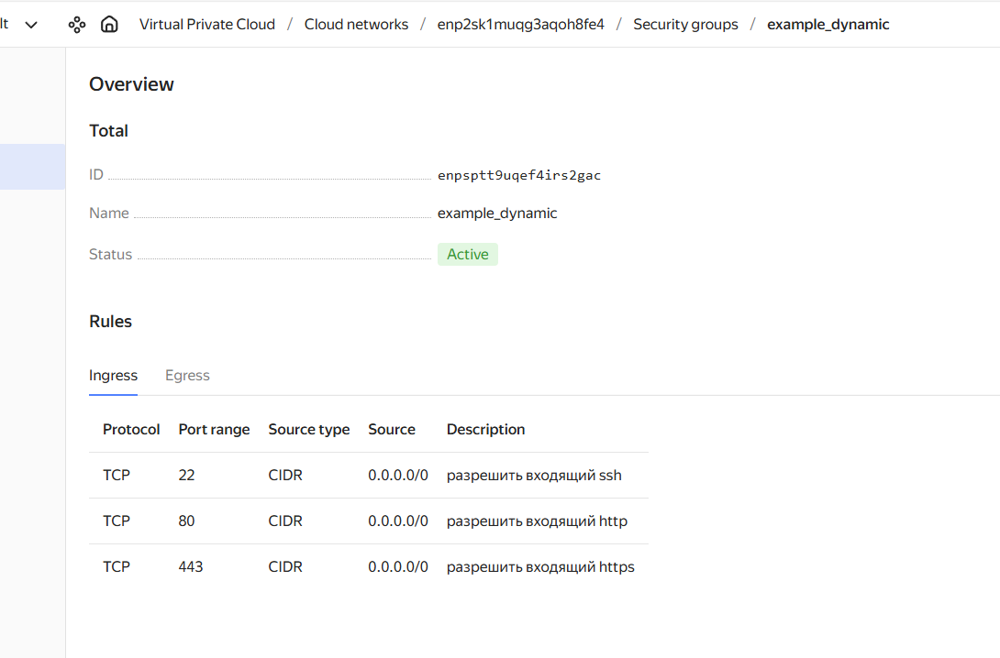
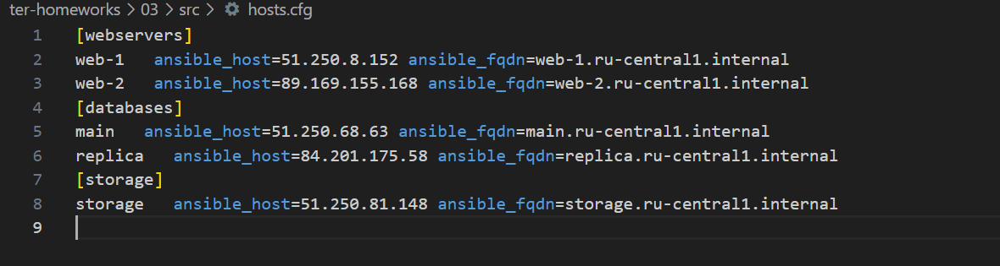

1 Задание
Приложите скриншот входящих правил «Группы безопасности» в ЛК Yandex Cloud .

ssh ключ поместил в ссылку на конректный файл. Да, директория под винду, в случае если бы работал "в команде" или над каким то проектом, то указывал бы на корневую дирректорию (и уж врятли бы работал из под винды :)

Задание 2
Опишите в нём создание двух ВМ для баз данных с именами "main" и "replica" разных по cpu/ram/disk_volume , используя мета-аргумент for_each loop.
В данном случае используем переменную с типом map, в которой указанно множество параметров. Сама переменная как обычно расписана в файле variables.tf

Задание 3
Создайте 3 одинаковых виртуальных диска размером 1 Гб с помощью ресурса yandex_compute_disk и мета-аргумента count в файле disk_vm.tf .
Значением coun задаем количество дисков, за уникальные имена каждого диска отвечает формула "disk-${count.index + 1}"
```
resource "yandex_compute_disk" "hdd" {
  count             = 3
  name              = "disk-${count.index + 1}"
  zone              = var.default_zone
  size              = var.disk_size
  type              = var.disk_type
}
```

4 задание 

